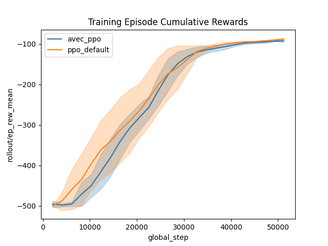
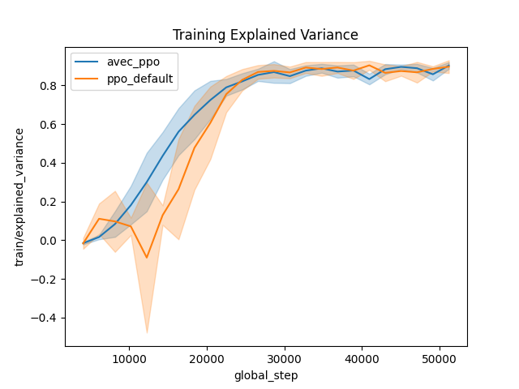

# Overview

In this tutorial we are interested in reproducible reinforcement learning research. The experiments in this repository aim to reproduce some deep reinforcement learning results from the paper [Learning Value Functions in Deep Policy Gradients using Residual Variance](https://arxiv.org/pdf/2010.04440). To do so we use specific [emprirical protocole](https://arxiv.org/abs/2304.01315) and open-source libraries that we introduce next.

### Empirical reinforcement learning research.

### Stable deep reinforcement learning agents and study tools (seeding, plotting, agents comparison).
#### Stable-baselines3
#### rlberry
- seeding
- agent manager
- hyperparams optimization
#### Adastop
- statistically significant comparisons


### Usage
Tested on Python 3.10
```bash
python3 -m venv .venv
source .venv/bin/activate
pip install -r requirements.txt
cd empirical_rl
```

##### Training
```bash
python3 training.py
```
##### Plotting
```bash
python3 plotting.py
```
#### Evaluating
```bash
python3 evaluating.py
```
#### Adastop (long)
```bash
python3 statistical_comparing.py
```


## Expected Results




#### Adastop expected results
```bash
[INFO] 13:10: Test finished 
[INFO] 13:10: Results are  
          Agent1 vs Agent2  mean Agent1  mean Agent2  mean diff decisions
0  default_ppo vs avec_ppo      -86.636    -118.6952    32.0592     equal
```


# TODOs
- Ant-v4
- Loop over hyperparams and expand boundaris (hyperparam optim as per Patterson 2023)
- Docstrings ?
- Fix bug data loading for plotting data.